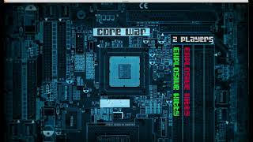

<div align="center">  </div>

# Corewar @ 1337


Core War is a 1984 programming game created by D. G. Jones and A. K. Dewdney in which two or more battle programs compete for control of a virtual computer. These battle programs are written in an abstract assembly language called Redcode.([Wikipedia](https://en.wikipedia.org/wiki/Core_War))

## This project can be broken down into four distinctive parts: ##

  * **The assembler**: this is the program that will compile champions and translate them from the language written them in (assembly language) into “Bytecode”. Bytecode is a machine code, which will be directly interpreted by the virtual machine.
  * **The virtual machine**: It’s the “arena” in which champions will be executed. It offers various functions, all of which will be useful for the battle of the champions. Obviously, the virtual machine should allow for numerous simultaneous processes.
  * **The champion**: It's necessary to create a simple champion just to prove the program functionality.
  * **The disassembler**: this program will generate the assembly source code from the compiled machine code.
  it's not guaranteed that the generated source code will be identical to the original source code.

## Compiling ##

  Before you start, make sure that sdl2 is installed in your machine and update folder lib with your lib files.

  ### To compile: ##
  ```
  make
  ```
  ### To compile specific program ##
  programs:

  1. **Corewar**: It’s the “arena” in which champions will be executed
  2. **asm**: It's the assembler
  3. **dsm**: It's the disassembler
  4. **visu**: It's the visualization

  ```
  make [program]
  ```
  ### Clean objects ###
  ```
  make clean
  ```
  ### Clean objects and programs ###
  ```
  make fclean
  ```
  ### Re-compile All ###
  ```
  make re
  ```

## Demo ##

[](https://www.youtube.com/watch?v=XWNpR2hF4fI "Corewar | 1337")
  


## contributors ##

[jalalium](https://github.com/jalalium)  && Ayoub Alaoui

## Licence ##
[MIT](https://choosealicense.com/licenses/mit) License.
